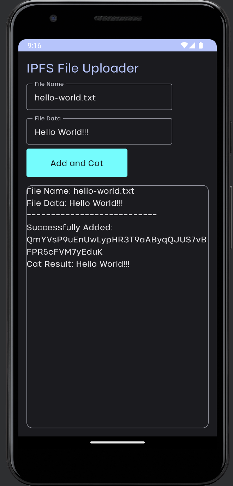

# **IPFS Wrapper - Android (Kotlin) Demo**

[](https://opensource.org/licenses/MIT)

## **Introduction**

This demo walks through a basic integration of the IPFS wrap in Android applications.

The IPFS wrap enables applications to interact with the IPFS protocol. This single wrap can be used across various types of apps (web, mobile, servers) as long as the appropriate Polywrap client library is installed.

This example Android app creates a simple text file, and then uses the Polywrap client to add the file to IPFS. The resulting IPFS hash is then displayed on the screen.

---

## **System Requirements**

- Android Studio
- Docker Desktop

## **Getting Started**

Link or open the Gradle project located at `ipfs/demos/kotlin/build.gradle` in Android Studio. Sync the project with Gradle.

Next, install dependencies and build the app:

```bash
./gradlew build
```

Set up the test environment:

> Ensure your system's Docker Daemon is running.

```bash
cd ../../infra/local-ipfs-node && docker compose up && cd ../../demos/kotlin
```

Now run the app on an emulator or device. When the app starts, you'll see two text boxes and a button. If you did everything correctly, when you click the button you should see the content of the file you added to IPFS.



## **What Happened Explained**

In the `./app/src/main/java/io/polywrap/ipfsdemo/IpfsVewModel.kt` file, the Polywrap client is instantiated and configured using the IPFS wrap's URI:

`"ens/wraps.eth:ipfs-http-client@1.0.0"`

This URI directs the Polywrap client to locate the IPFS wrap, which is resolved via an Ethereum Name Service (ENS) domain.

When you click the `Add and Cat` button, a text file named `hello-world.txt` is created and added to IPFS by invoking the `addFile` method on the wrap.

The code for the client invocation can be seen in `./app/src/main/java/io/polywrap/ipfsdemo/IpfsVewModel.kt`.

Lastly, the text file is retrieved by invoking the IPFS `cat` method on the wrap, and its content is displayed.
